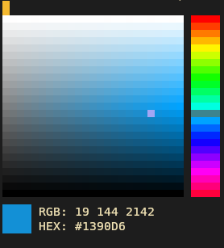

<div align="center">
    
    <h1>clid - Command line Color Picker</h1>
</div>

`clid` allows you to view, choose and convert colors in RGB, HEX, HSL and CMYK formats using a simple tui.

## Features
- No external librarys needed.
- TUI Coose color dialog.
- View colors in your terminal.
- Change TUI scaling.
- Use output in your own scripts or tools.
- Suports RGB, HEX, HSL, CMYK

## Usage

```shell
# Run clid in normal mode. This lets you choose a color and outputs it to stdout on quit.
$ clid

# Same as before but output in cmyk format.
$ clid --format=cmyk

# You can pipe the output into your clipboard:
$ ./clid --format=hex | wl-copy            # For Weyland
$ ./clid --format=hex | xsel -i -b         # For X11
$ ./clid --format=hex | xclip -i -sel clip # For X11

# Or capture it in a variable (you can add options here as well, like ./clid -W):
$ color=$(./clid)             # Preferred.
$ read -r color < <(./clid)   # Works in bash, ksh, zsh, ..., but **not sh**

# Use --help to get a list of all arguments and view tui inputs.
$ clid --help
```

## Build & Install
```shell
# Clone clid repo
$ git clone https://github.com/iinsertNameHere/clid.git
$ cd clid

# Build using make
$ make

# Install using make
$ make install

# Run program
$ clid
```

#### Uninstall:
```shell
$ make uninstall
```

#### Update
```shell
# Navigate to repo folder and pull latest changes
$ git pull origin main

# Uninstall currently installed version
$ make uninstall

# Install & build new version
$ make
$ make install
```

## Showcase

